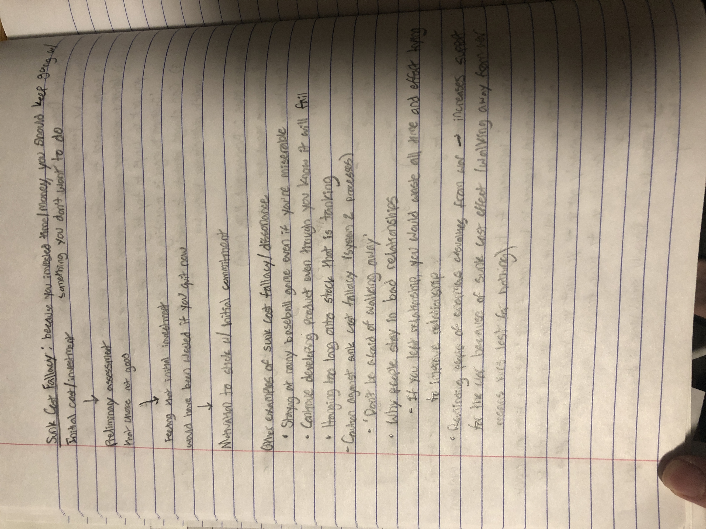

```{r setup, include = FALSE}
knitr::opts_chunk$set(echo = FALSE)
library(tidyverse)
library(ggplot2)
```

\#Big Header \#\# Medium Header Hi, welcome to **Psych 4175** *Applied Stats. Wow!*



```{r math}
x = 2 + 4
print(x)
library(palmerpenguins)
print(head(penguins))
```

$2+3=5$

Add a new chunk by clicking the *Insert Chunk* button on the toolbar or by pressing *Cmd+Option+I*.

When you save the notebook, an HTML file containing the code and output will be saved alongside it (click the *Preview* button or press *Cmd+Shift+K* to preview the HTML file).

The preview shows you a rendered HTML copy of the contents of the editor. Consequently, unlike *Knit*, *Preview* does not run any R code chunks. Instead, the output of the chunk when it was last run in the editor is displayed.
